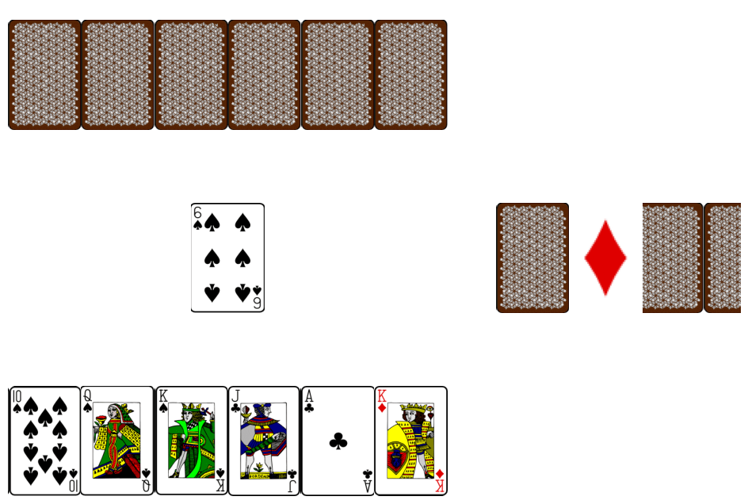

Project based on previous version [Base_Fool](https://github.com/Mike030668/Base_Fool)

# Durak Card Game

This project implements the classic Russian card game "Durak" (Fool). The game involves multiple players, including human and robot players, playing against each other with a standard deck of cards. The objective of the game is to avoid being the last player with cards in hand. The last player with cards is called the "Durak".

## Features

- **Multiple Players:** The game supports both human and robot players.
- **Dynamic Gameplay:** Players can make moves or pass their turn. Robot players can choose moves randomly or based on the minimum card strategy.
- **Interactive Visualization:** The game state, including the cards in hand, on the field, and in the discard pile, is visualized using `matplotlib`.
- **Clear Instructions:** Prompts and instructions are provided to guide human players throughout the game.

 

## Getting Started

Check in [colab](https://colab.research.google.com/github/Mike030668/Base_Fool_images/blob/master/play_fool.ipynb)

### Prerequisites

- Python 3.7 or higher
- Required Python packages: `matplotlib`, `numpy`, `pandas`, `IPython`

### Installation

1. **Clone the Repository:**

   ```bash
   git clone https://github.com/yourusername/durak-card-game.git
   cd durak-card-game

